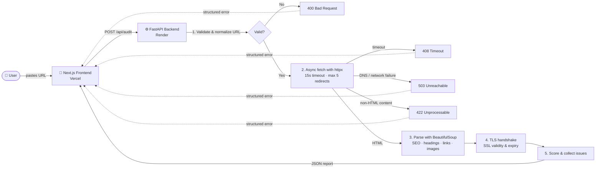

<div align="center">

# 📟 Page Pulse

### Take the pulse of any webpage in seconds.

A fault-tolerant website audit tool that checks a page's **SEO, structure, SSL, links, images and performance**, then gives it a **score out of 100** and a list of things to fix, all in a warm 90s retro-vintage interface.

[](https://page-pulse-itgn.vercel.app/)
[](https://page-pulse-api-bjm5.onrender.com/health)


</div>

---

## 🌐 Live Deployment

| Layer | Platform | URL |
|-------|----------|-----|
| 🎨 **Frontend** | Vercel | **https://page-pulse-itgn.vercel.app/** |
| ⚙️ **Backend API** | Render | **https://page-pulse-api-bjm5.onrender.com** |
| 💓 **Health Check** | Render | [`/health`](https://page-pulse-api-bjm5.onrender.com/health) |
| 📚 **Interactive API Docs** | Render (Swagger UI) | [`/docs`](https://page-pulse-api-bjm5.onrender.com/docs) |

> [!NOTE]
> The backend runs on Render's free tier, which puts the service to sleep after a period of inactivity. If nobody has used it recently, **the first audit can take 30–60 seconds** while the server wakes up. Requests after that are fast.

---

## 📖 Table of Contents

- [The Idea](#-the-idea)
- [Features](#-features)
- [How It Works](#-how-it-works)
- [Scoring Model](#-scoring-model)
- [Tech Stack](#-tech-stack)
- [Getting Started](#-getting-started)
- [API Reference](#-api-reference)
- [Testing](#-testing)
- [Project Structure](#-project-structure)
- [Design Decisions](#-design-decisions)
- [Deployment](#-deployment)
- [AI Collaboration](#-ai-collaboration)

---

## 💡 The Idea

Every website owner wants to know whether their page is in good shape. Is the SEO set up correctly? Is the SSL certificate about to expire? Do the images have alt text? Is the heading structure sensible? Most tools that answer these questions are slow, cluttered, locked behind sign-ups, or produce reports full of jargon.

**Page Pulse keeps it simple: paste a URL and get one clear report.**

The project rests on two principles:

1. **Defensibility.** Users will paste broken links, typos, PDFs, dead domains and very slow servers. Every one of those cases is handled on purpose, so neither the API nor the UI ever crashes. The user always gets either a report or a clear, friendly error message.
2. **Personality.** Diagnostic tools don't have to look like gray dashboards. Page Pulse uses cream and amber tones, a film-grain overlay, serif headlines and monospace readouts, so it feels memorable and friendly while staying easy to read.

---

## ✨ Features

| Category | What Page Pulse checks |
|----------|------------------------|
| 🌍 **Availability** | HTTP status code, final URL after redirects, response time (ms) |
| 🔒 **Security** | SSL certificate validity, issuer and days until expiry |
| 🔎 **SEO Meta** | `<title>` and meta description, including whether their lengths fall in the ideal range |
| 🏷️ **Social & Indexing** | Canonical link, Open Graph tags, Twitter Card tags, favicon, robots meta |
| 🧱 **Structure** | Full H1–H6 heading breakdown, with a flag when there isn't exactly one H1 |
| 🔗 **Links** | Internal vs. external link counts |
| 🖼️ **Accessibility** | Total images and how many are missing `alt` text |
| ⚡ **Performance** | Page weight (KB) and approximate visible word count |
| 🏆 **Verdict** | A composite **0–100 score** and a list of specific issues to fix |

**On the UI side:**

- An animated **score ring** with color-coded health
- **Metric cards** and an SEO checklist where pass/warn/fail states are visible at a glance
- URL validation in the browser **and** on the server
- Clear loading states and a dedicated **error card** for every failure mode
- A responsive layout that works on mobile and desktop

---

## 🔄 How It Works



1. **Validate.** Pydantic normalizes the input (adding `https://` if it's missing) and rejects malformed hosts before any network call is made.
2. **Fetch.** `httpx.AsyncClient` fetches the page asynchronously, with a 15-second timeout, up to 5 redirects and a 2 MB body cap.
3. **Parse.** BeautifulSoup walks the DOM to pull out meta tags, headings, links, images and visible text.
4. **Inspect SSL.** A direct TLS handshake reads the certificate's issuer and expiry date.
5. **Score.** A weighted heuristic produces a 0–100 score and a list of specific issues.
6. **Render.** The frontend shows the report as a dashboard. If something fails, the error card explains what happened.

---

## 🏆 Scoring Model

Every page starts at a **baseline of 50** and earns points for good practices. The final score is capped at **100**.

| Signal | Points |
|--------|:------:|
| Title present (+10 if 30–60 chars, otherwise +5) | up to **+10** |
| Meta description present (+10 if 50–160 chars, otherwise +5) | up to **+10** |
| Valid SSL certificate | **+10** |
| Canonical link tag | +5 |
| Open Graph tags | +5 |
| Favicon | +5 |
| Exactly one H1 | +5 |
| At least one H2 | +5 |
| All images have alt text (−1 per missing image) | up to +5 |
| HTTP status below 400 | +5 |
| Page weight under 1.5 MB | +5 |

---

## 🛠 Tech Stack

| Layer | Technologies |
|-------|--------------|
| **Frontend** | Next.js 15 (App Router), React 19, TypeScript (strict), Tailwind CSS, `clsx` + `tailwind-merge` |
| **Typography** | Playfair Display (serif), Inter (sans), IBM Plex Mono (mono) via `next/font` |
| **Backend** | FastAPI, Pydantic v2, `httpx` (async), BeautifulSoup4, Uvicorn |
| **Testing** | `pytest`, `pytest-asyncio`, `pytest-mock`, FastAPI `TestClient` |
| **Hosting** | Vercel (frontend) · Render (backend, configured via `render.yaml`) |

---

## 🚀 Getting Started

### Prerequisites

- **Python** 3.12+
- **Node.js** 20+

### 1. Clone the repository

```bash
git clone https://github.com/anshika368/Page_Pulse.git
cd Page_Pulse
```

### 2. Run the backend

```bash
cd backend
python -m pip install -r test-requirements.txt
python -m uvicorn main:app --host 127.0.0.1 --port 8000
```

The API runs at `http://127.0.0.1:8000`, and Swagger docs are at `http://127.0.0.1:8000/docs`.

### 3. Run the frontend

In a second terminal:

```bash
cd frontend
npm install
npm run dev
```

Open **http://localhost:3000** and run your first pulse check.

### Environment variables

| Variable | Where | Default | Purpose |
|----------|-------|---------|---------|
| `NEXT_PUBLIC_API_URL` | `frontend/.env.local` | `http://127.0.0.1:8000` | Base URL of the backend API (embedded at build time) |
| `CORS_ALLOWED_ORIGINS` | backend environment | `*` | Comma-separated list of allowed frontend origins |

---

## 📡 API Reference

**Base URL:** `https://page-pulse-api-bjm5.onrender.com`

| Method | Endpoint | Description |
|--------|----------|-------------|
| `GET` | `/health` | Service health check |
| `POST` | `/api/audit` | Run a full audit on a URL (**canonical**) |
| `POST` | `/audit` | Backward-compatible alias of `/api/audit` |

### Try it

```bash
curl -X POST https://page-pulse-api-bjm5.onrender.com/api/audit \
  -H "Content-Type: application/json" \
  -d '{"url": "https://example.com"}'
```

### Success response (`200 OK`)

<details>
<summary>Click to expand the full sample response</summary>

```json
{
  "url": "https://example.com",
  "final_url": "https://example.com/",
  "timestamp": "2026-07-25T09:07:43.575752Z",
  "status": "ok",
  "status_code": 200,
  "http_status": 200,
  "response_time_ms": 492.11,
  "page_title": "Example Domain",
  "meta_description": null,
  "h1_count": 1,
  "images_missing_alt_text": 0,
  "approximate_word_count": 18,
  "ssl": {
    "valid": true,
    "expires_in_days": 35,
    "issuer": "US SSL Corporation Cloudflare TLS Issuing ECC CA 3"
  },
  "seo": {
    "title": "Example Domain",
    "description": null,
    "title_length": 14,
    "description_length": 0,
    "has_canonical": false,
    "has_open_graph": false,
    "has_twitter_card": false,
    "has_favicon": true,
    "robots_meta": null
  },
  "headings": { "h1": 1, "h2": 0, "h3": 0, "h4": 0, "h5": 0, "h6": 0 },
  "links": { "internal": 0, "external": 1, "total": 1 },
  "images": { "total": 0, "without_alt": 0 },
  "performance": { "page_size_kb": 0.55, "approximate_word_count": 18 },
  "score": 90,
  "issues": [
    "Title length is 14 chars (ideal: 30–60).",
    "Missing meta description.",
    "Missing canonical link tag."
  ],
  "raw_headers": {}
}
```

</details>

### Error responses

All errors share one predictable shape:

```json
{
  "detail": "Human-readable explanation",
  "status": "error | timeout | unreachable"
}
```

| Code | Meaning | Example trigger |
|:----:|---------|-----------------|
| `400` | Invalid or malformed URL | `{"url": "not-a-valid-url"}` |
| `408` | Target server took too long to respond | Slow or hanging host |
| `422` | Response is not HTML | URL points to a PDF or image |
| `503` | Host unreachable | DNS failure or non-existent domain |
| `500` | Unexpected server failure | Caught by the global exception handler |

---

## 🧪 Testing

The backend test suite is **fully deterministic**. It never touches the internet.

```bash
cd backend
python -m pytest tests/ -v
```

- `FakeAsyncClient` and `FakeHttpxResponse` replace `httpx.AsyncClient` via `pytest-mock`.
- Network responses, timeouts and DNS failures are simulated, so the suite runs offline in under a second.

| Test | Scenario covered |
|------|------------------|
| `test_audit_valid_url_returns_expected_fields` | Happy path: every report field is populated correctly |
| `test_audit_non_html_response` | A PDF or other non-HTML payload returns `422` |
| `test_audit_invalid_url_returns_400` | A malformed URL is rejected at the edge |
| `test_audit_missing_url_field_returns_400` | A request body without `url` is rejected |
| `test_audit_unreachable_host_returns_503` | A DNS or network failure is handled gracefully |
| `test_audit_timeout_returns_408` | A slow upstream host returns a clean timeout |
| `test_audit_empty_page_still_returns_report` | An empty HTML document still produces a valid report |

---

## 📁 Project Structure

```
Page_Pulse/
├── backend/
│   ├── main.py               # FastAPI app, routes, CORS, exception handlers
│   ├── models.py             # Pydantic request/response models + URL validation
│   ├── audit_service.py      # Fetching, HTML parsing, SSL inspection, scoring
│   ├── tests/
│   │   ├── conftest.py       # Fake httpx client & response fixtures
│   │   └── test_audit.py     # API test suite
│   ├── requirements.txt      # Runtime dependencies
│   ├── test-requirements.txt # Runtime + test dependencies
│   └── pytest.ini
├── frontend/
│   ├── src/
│   │   ├── app/              # App Router: layout, page, global styles, error boundary
│   │   ├── components/       # AuditForm, AuditReport, ScoreRing, MetricCard,
│   │   │                     # LoadingState, ErrorDisplay, Footer
│   │   ├── lib/              # API client (AuditFetchError) & utilities
│   │   └── types/            # Shared TypeScript types for the audit contract
│   ├── tailwind.config.ts    # Retro palette: cream, amber, ink, teal, rose
│   ├── next.config.ts
│   ├── vercel.json
│   └── package.json
├── render.yaml               # Render Blueprint for the backend
├── DEPLOYMENT.md             # Step-by-step Render + Vercel guide
├── AI_COLLABORATION.md       # How AI was used in this project
└── README.md
```

---

## 🧠 Design Decisions

### 1. FastAPI for an I/O-heavy workload

Auditing a page is mostly waiting on the network: DNS lookups, TLS handshakes and HTTP fetches. FastAPI's native `async`/`await` lets the server handle many audits at once without blocking threads. Pydantic v2 validates requests **before** any network call, so bad input is rejected at the edge instead of reaching the parser.

### 2. A narrow, typed contract with client-side resilience

The frontend and backend communicate through a single, well-typed endpoint. The Next.js client wraps every failure in a custom `AuditFetchError` and shows it in a dedicated `ErrorDisplay` component. As a result:

- A timeout shows a friendly message, not a stack trace.
- A malformed URL is caught on both the client and the server.
- If the backend is down, the UI stays up and the user can simply retry.

### 3. Fail fast on non-HTML content

Page Pulse is an HTML auditor. PDFs, images and JSON are rejected with a clear `422` instead of being passed to the parser. Response bodies are capped at 2 MB so a very large page can't exhaust memory.

### 4. A 90s retro aesthetic

Cream and amber tones, a subtle film-grain overlay, and serif headings paired with monospace data give Page Pulse a distinct identity. The styling still serves readability: high-contrast cards, a clear type hierarchy and a restrained palette keep the report easy to scan.

---

## ☁️ Deployment

| Service | Platform | Config |
|---------|----------|--------|
| Backend | [Render](https://render.com) (Python web service, free tier) | [`render.yaml`](render.yaml), health check on `/health` |
| Frontend | [Vercel](https://vercel.com) (Next.js) | [`frontend/vercel.json`](frontend/vercel.json), `NEXT_PUBLIC_API_URL` set to the Render URL |

Both platforms redeploy automatically on every push to `master`. For the full step-by-step guide, including CORS lockdown and troubleshooting, see **[`DEPLOYMENT.md`](DEPLOYMENT.md)**.

---

## 🤝 AI Collaboration

AI tools helped speed up boilerplate (route scaffolding, pytest fixtures), styling exploration and documentation formatting. The architecture, fault-tolerance logic, scoring heuristics and UI direction were designed and owned by me. Read more in **[`AI_COLLABORATION.md`](AI_COLLABORATION.md)**.

---

<div align="center">

**[🚀 Try Page Pulse live](https://page-pulse-itgn.vercel.app/)**

Built for the **[Digital Heroes](https://digitalheroesco.com)** training task.

</div>
